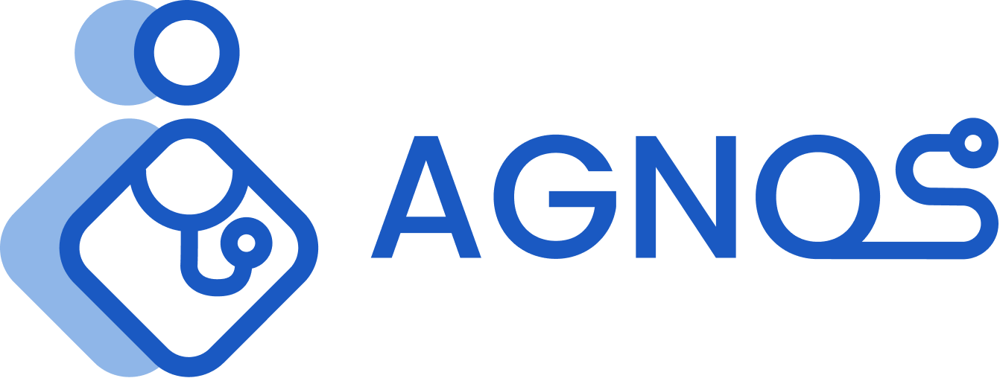

<p align="center">
  
</p>

# Agnos Chatbot — Neo4j RAG + LangChain + BGE-m3 + Gradio

A minimal chatbot that retrieves Thai medical context from a **Neo4j knowledge graph** (doctor-answered threads + disease pages), builds a numbered context (T#/D#), and answers via **LangChain** with **tool-calling**.  
Works with either:
- **OpenAI** models (easiest to start), or
- **Ollama** local models (e.g., `llama3.2`) — fully local.

> ⚠️ Health disclaimer: This app provides general information only; it does not diagnose or replace professional medical advice.

<p align="center">
  <video src="assets/agnos_demo.mp4" width="720" controls muted playsinline>
    Your browser does not support the video tag. Watch the
    <a href="assets/agnos_demo.mp4">demo video</a>.
  </video>
</p>

---

## Contents

- [Prerequisites](#prerequisites)  
- [Option A: OpenAI setup](#option-a-openai-setup)  
- [Option B: Ollama setup (local models)](#option-b-ollama-setup-local-models)  
- [Set up Neo4j AuraDB](#set-up-neo4j-auradb)  
- [Project configuration](#project-configuration)  
- [Create the Python environment](#create-the-python-environment)  
- [Prepare data & indexes (one-time)](#prepare-data--indexes-one-time)  
- [Run the app](#run-the-app)  
- [Repo structure](#repo-structure)  
- [Troubleshooting](#troubleshooting)

---

## Prerequisites

- **Conda** (Anaconda or Miniconda)  
- **Python 3.11** (the provided environment file ensures this)  
- **Git** (optional but recommended)

Use **either** OpenAI **or** Ollama:

- If using **OpenAI**: an **OpenAI API key**  
- If using **Ollama**: install **Ollama** and pull a model (e.g., `llama3.2`)

You also need a **Neo4j AuraDB** instance (free tier works).

---

## Option A: OpenAI setup

1. Get your key from OpenAI.  
2. Copy `.env.example` → `.env`, then set:
   ```dotenv
   MODEL_PROVIDER=openai
   OPENAI_API_KEY=sk-...your-key...
   OPENAI_MODEL=gpt-4o-mini
   ```

---

## Option B: Ollama setup (local models)

1. Install **Ollama** on your machine.  
2. Pull a model (example: Llama 3.2):
   ```bash
   ollama pull llama3.2
   ```
3. In `.env`, set:
   ```dotenv
   MODEL_PROVIDER=ollama
   OLLAMA_HOST=http://localhost:11434
   OLLAMA_MODEL=llama3.2
   ```
*(Leave OpenAI variables empty when using Ollama.)*

---

## Set up Neo4j AuraDB

1. Create a free **AuraDB** instance at https://console.neo4j.io/.  
2. **After creating the instance**, Aura **downloads a `.txt` file** with your credentials. It looks like this:

   ```
   # Wait 60 seconds before connecting using these details, or log in to https://console.neo4j.io to validate the Aura instance is available.
   NEO4J_URI=neo4j+s://92e8f832.databases.neo4j.io
   NEO4J_USERNAME=neo4j
   NEO4J_PASSWORD=xxxx
   NEO4J_DATABASE=neo4j
   AURA_INSTANCEID=xxxx
   AURA_INSTANCENAME=xxxx
   ```

   - The **four `NEO4J_*` values** are what the app needs.
   - The `AURA_*` lines are informational and **not required** by the app.
   - Waiting ~60 seconds before first connect is normal.

3. Copy the four `NEO4J_*` values into your `.env`:
   ```dotenv
   NEO4J_URI=neo4j+s://92e8f832.databases.neo4j.io
   NEO4J_USERNAME=neo4j
   NEO4J_PASSWORD=xxxx
   NEO4J_DATABASE=neo4j
   ```

---

## Project configuration

Copy `.env.example` → `.env` and fill in the values:

```dotenv
# Model
MODEL_PROVIDER=openai        # or: ollama
OPENAI_API_KEY=              # set only if using OpenAI
OPENAI_MODEL=gpt-4o-mini
OLLAMA_HOST=http://localhost:11434
OLLAMA_MODEL=llama3.2
TEMPERATURE=0.2

# Neo4j
NEO4J_URI=
NEO4J_USERNAME=
NEO4J_PASSWORD=
NEO4J_DATABASE=neo4j

# UI (optional)
COVER_HEIGHT_PX=240
BG_RGB=143,182,232
```

`configs/retrieval_chat.yaml` already contains the **index names** and **retrieval queries** used by the app:
- `thread_titlecat_idx` querying the `title_category` property
- `disease_symptom_idx` querying the `symptom_disease` property

---

## Create the Python environment

We provide a **lean CPU-only** env (no CUDA needed):

```bash
conda env create -f environment.yml
conda activate agnos-test
```

---

## Prepare data & indexes (one-time)

The chat app assumes data & vector indexes already exist in Neo4j.  
Create them with the included notebooks:

1. **Scrape** data
   - Open `notebooks/scrape_thread.ipynb` → run all  
     - Outputs `data/agnos_forum_threads.json`
   - Open `notebooks/scrape_disease.ipynb` → run all  
     - Outputs `data/agnos_diseases.json`

2. **Ingest & index**  
   Open `notebooks/ingest_index.ipynb` → run all.  
   This will:
   - Load the two JSON files
   - **Compute BGE-m3 embeddings** (no text chunking — see note below)
   - Upsert nodes to Neo4j
   - Create two vector indexes **with combined search properties**:

     **Threads**
     - Property **`title_category`** = **`title`** (user’s thread title) **+** **`thread_category`** (site category)
     - Vector index name: **`thread_titlecat_idx`**

     **Diseases**
     - Property **`symptom_disease`** = concatenation of **“ข้อมูลโรคและสาเหตุการเกิดโรค”** + **“อาการของโรค”**
     - Vector index name: **`disease_symptom_idx`**

   **Note:** We **do not split text into chunks** here. Each thread remains a single node embedding (data per thread is small and we want results at the thread level).

3. **(Optional) Install Jupyter if you don’t have it in this env**
   ```bash
   conda install -n agnos-test -c conda-forge jupyterlab
   jupyter lab
   ```

---

## Run the app

```bash
conda activate agnos-test
python run_app.py
```

Gradio will show a local URL in the terminal (default `http://127.0.0.1:7860`).  
Ask health questions in Thai (or English). The LLM will call the retrieval tool **only for symptom/disease queries**.

**What the app does**
- Performs **two** vector searches in Neo4j (threads & diseases)
- Builds a numbered context:
  - **T#** = doctor-answered threads
  - **D#** = disease references
- The LLM composes an answer, citing `[T1]`, `[D2]`, etc., plus a “แหล่งอ้างอิง” block.

---

## Repo structure

```
agnos-chatbot/
├─ run_app.py                      # entry point (launches Gradio)
├─ environment.yml                 # minimal, CPU-only env for this app
├─ .env.example                    # copy → .env and fill in
├─ configs/
│  └─ retrieval_chat.yaml          # Neo4j index names/queries, UI title, prompt path
├─ prompts/
│  └─ system_th.txt                # Thai system prompt
├─ assets/
│  └─ agnos_health_cover.jpg       # banner
├─ agnos_chatbot/                  # Python package (refactor of retrieval_&_chat)
│  ├─ __init__.py
│  ├─ model_factory.py             # OpenAI or Ollama model selector
│  ├─ retrieval.py                 # tool, context builder, chat loop
│  ├─ ui.py                        # wiring + Gradio Blocks
│  └─ utils/
│     ├─ config.py                 # load_yaml()
│     ├─ embeddings.py             # BGE-m3 via sentence-transformers
│     └─ neo4j_vec.py              # Neo4jVector retrievers (threads/diseases)
├─ notebooks/                      # keep as notebooks
│  ├─ scrape_thread.ipynb
│  ├─ scrape_disease.ipynb
│  └─ ingest_index.ipynb
└─ data/
   ├─ agnos_diseases.json
   └─ agnos_forum_threads.json
```

---

## Troubleshooting

**Ollama not found / model missing**
```bash
ollama --version
ollama pull llama3.2
```
Then confirm `.env` has:
```
MODEL_PROVIDER=ollama
OLLAMA_MODEL=llama3.2
```

**OpenAI: “API key not set”**  
Set `OPENAI_API_KEY` in `.env` and restart the app.

**Neo4j: auth/connection errors**  
Double-check `.env` values (from your Aura .txt file):
```
NEO4J_URI=neo4j+s://<id>.databases.neo4j.io
NEO4J_USERNAME=neo4j
NEO4J_PASSWORD=<password you set>
NEO4J_DATABASE=neo4j
```
Ensure the Aura instance is **RUNNING** and you waited ~60s after creation.

**No results / empty context**  
Run `notebooks/ingest_index.ipynb` to (re)build embeddings and ensure the two vector indexes exist with the exact names:
- `thread_titlecat_idx` (property: `title_category`)
- `disease_symptom_idx` (property: `symptom_disease`)
